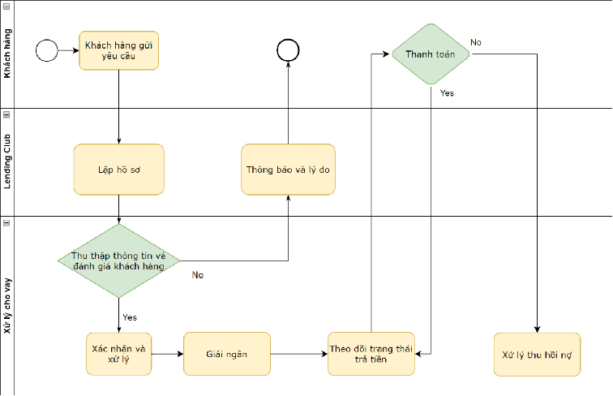
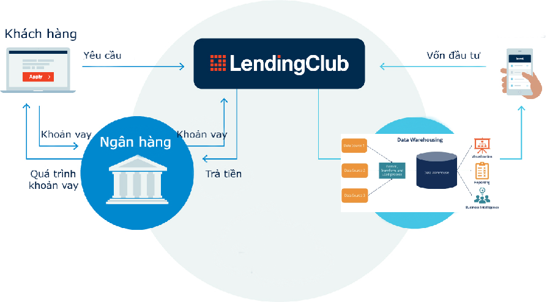
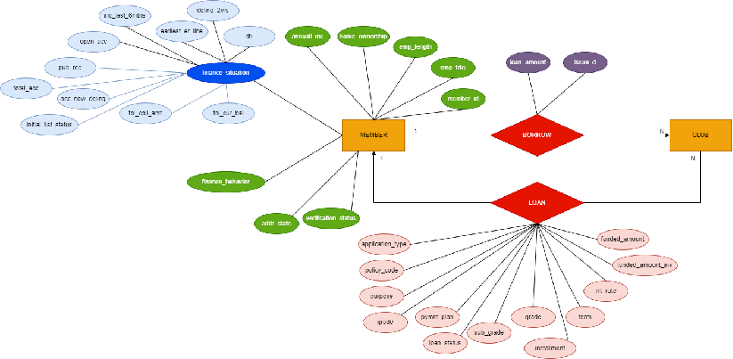
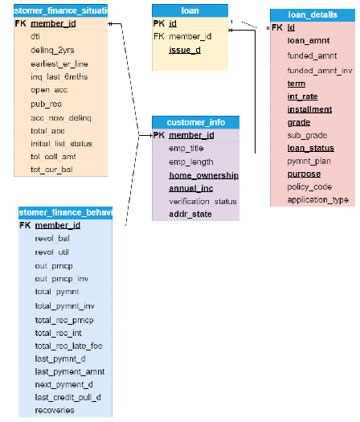

# Kho dữ liệu và kinh doanh thông minh
 Trong thời đại số hóa ngày càng phát triển, dữ liệu đã trở thành một tài nguyên quan trọng, được coi là "dầu mỏ" của thế kỷ XXI. Hiểu và khai thác dữ liệu một cách thông minh đã trở thành yếu tố quyết định sự thành công của các doanh nghiệp và tổ chức trong mọi lĩnh vực. Kho dữ liệu, cùng với công nghệ phân tích dữ liệu và trí tuệ nhân tạo, đóng vai trò quan trọng trong việc tạo ra thông tin hữu ích và hiểu sâu về khách hàng, thị trường và quy trình kinh doanh.

Báo cáo này sẽ giới thiệu một số khái niệm cơ bản về kho dữ liệu và kinh doanh thông minh, từ cách xây dựng một kho dữ liệu hiệu quả, quản lý dữ liệu, cho đến quá trình trích xuất thông tin, phân tích và áp dụng dữ liệu trong kinh doanh.
# Bài toán cho vay tín dụng
Cho vay là một hình thức cung cấp tiền từ một bên (thường là ngân hàng hoặc tổ chức tài chính) đến một bên khác với điều kiện rằng số tiền này sẽ được trả lại sau một khoảng thời gian nhất định, thường kèm theo lãi suất hoặc phí dịch vụ.
## Quy trình nghiệp vụ

## Data flow

## Tổng quan bộ dữ liệu
Dữ liệu được thu thập từ trang Kaggle.

Tên bộ dữ liệu: LendingClub Issued Loans

Dữ liệu gồm: 
- 2 file dữ liệu và 1 file chứa US State Code và tên của vùng đó. 

• File lc_loan.csv: dữ liệu từ năm 2008 - 2015
-Kích thước: 441.77 MB
- 74 cột
- Gần 900 nghìn dòng

• File lc_2016_2017.csv: dữ liệu năm 2016 - 2017
-Kích thước: 282.74 MB
-72 cột
-Gần 800 nghìn dòng

Nội dung bộ dữ liệu: Cơ sở dữ liệu gồm thông tin các khoản vay của Lending Loan club từ năm 2007-2017. 
# Yêu cầu bài toán
Yêu cầu bài toán là xây dựng một báo cáo tổng quan Dashboard phân tích khoản tiền khách hàng vay, Phân tích khoản tiền khách hàng trả, Phân tích số tiền lãi nhận được từ từng khách hàng, Phân tích số lượng khách hàng vay.

## Mô hình thực thể liên kết và OLTP

## Khám phá dữ liệu

